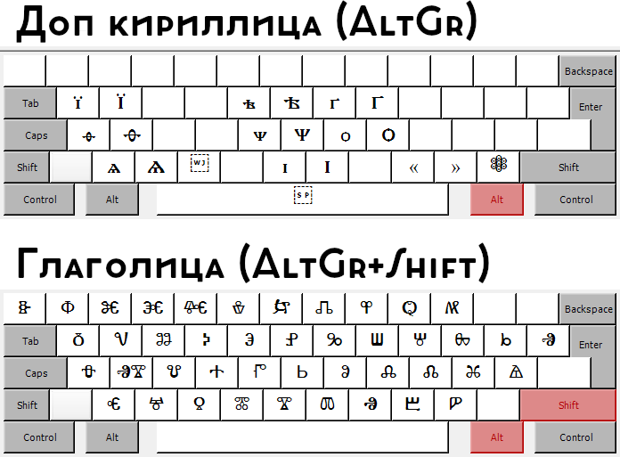

# CGKL
CGKL (Cyrillic-Glagolic keyboard layout) - это раскладка клавиатуры для ОС Windows, содержащая кириллические и глаголические символы. 
 
### Как работать с клавиатурой
---
Правый Alt = Расширенная кириллица 
Правый Alt + Shift = Глаголица 

  
### Как редактировать исходный файл
---
Редактирование исходного файла раскладки произходит через [Microsoft Keyboard Layout Creator](https://www.microsoft.com/en-us/download/details.aspx?id=102134).
